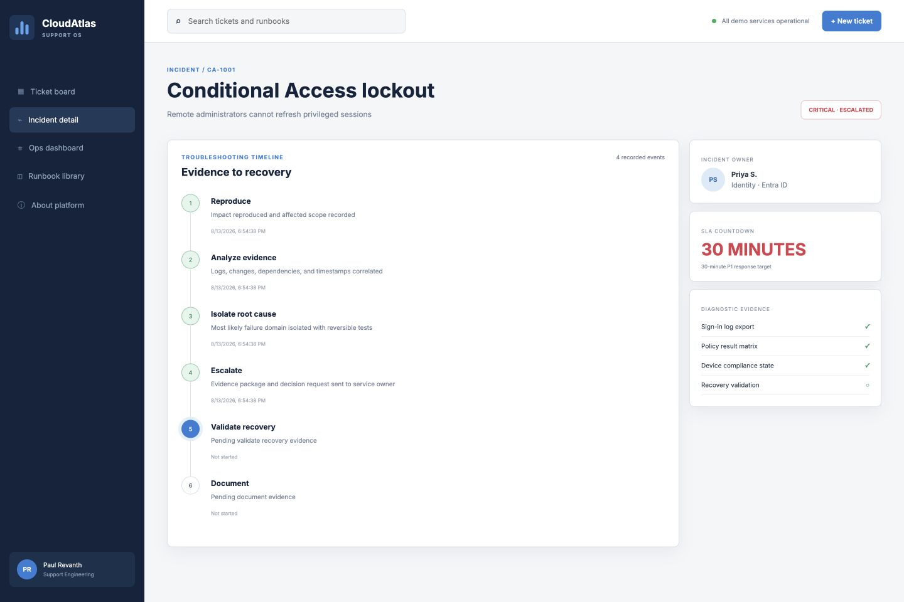
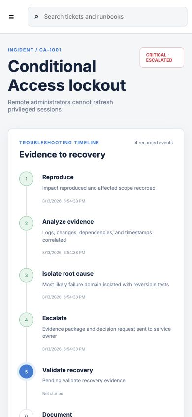
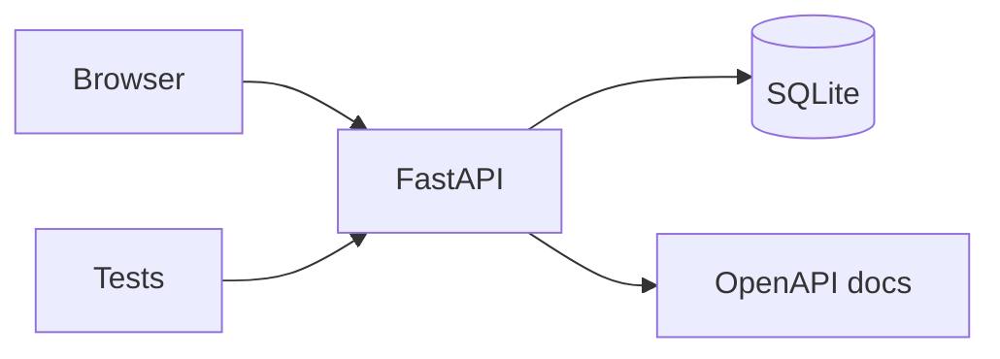

# CloudAtlas SupportOS

> An evidence-driven IT support operations platform for incident triage, SLA visibility, technical handoffs, and verified recovery.



## 1. Overview

CloudAtlas turns fragmented support activity into one operational story: user impact, priority, evidence, changes, ownership, recovery, and status communication. It is a working FastAPI and SQLite application with a responsive command-center interface.

## 2. Problem statement

Support teams often lose time across chat messages, ticket fields, screenshots, deployment notes, and handoffs. CloudAtlas keeps the evidence and decision trail together so the next engineer can understand what happened and what “resolved” means.

## 3. Core capabilities

- Impact-first incident intake and priority-based SLA targets
- Thirty seeded cases across identity, network, application, data, Linux, cloud, delivery, and security
- Append-only evidence and status timeline
- Eighteen searchable operational runbooks
- Recovery-confidence, category, priority, and service-health views
- Typed REST API with OpenAPI documentation
- Persistent local SQLite datastore
- Responsive desktop and mobile workspace

## 4. Product experience

The interface uses a calm command-center visual language: high contrast, restrained motion, clear priority signals, and progressive detail. Animations use transform and opacity properties so the UI stays responsive on high-refresh displays while respecting `prefers-reduced-motion`.



## 5. Architecture



See [the architecture record](docs/ARCHITECTURE.md) for scaling and production decisions.

## 6. Technology stack

| Layer | Technology |
|---|---|
| API | Python, FastAPI, Pydantic |
| Data | SQLite, parameterized SQL |
| UI | Semantic HTML, modern CSS, JavaScript |
| Delivery | Docker, Docker Compose, GitHub Actions |
| Quality | Pytest, FastAPI TestClient, compile checks |

## 7. Data model

`cases` stores current operational state for 30 seeded scenarios. `events` stores three to six evidence points per case. `runbooks` stores 18 searchable procedures. The separation allows fast queue rendering without discarding diagnostic and recovery decisions.

## 8. REST API

Start the service and visit [`http://localhost:8000/docs`](http://localhost:8000/docs). Routes and request examples are documented in [docs/API.md](docs/API.md).

## 9. Quick start

```bash
python3 -m venv .venv
source .venv/bin/activate
pip install -e '.[dev]'
uvicorn app.main:app --reload
```

Open `http://localhost:8000`.

## 10. Docker workflow

```bash
docker compose up --build
```

The service is exposed on port `8000`, uses a named data volume, runs as a non-root user, and includes a health check.

## 11. Testing and quality

```bash
pytest
python -m compileall app
```

Tests cover the 30-case seed, category breadth, case detail timelines, event creation, 18 runbooks, validation, case creation, and verified resolution. GitHub Actions repeats the same checks for every change.

## 12. Automated screenshots

```bash
make screenshots
```

The script starts the real application and uses headless Chrome to regenerate desktop and mobile images under `docs/screenshots/`. This keeps README evidence synchronized with the product.

## 13. Operations

Operational startup, investigation, reset, and recovery steps are in [docs/OPERATIONS_RUNBOOK.md](docs/OPERATIONS_RUNBOOK.md).

## 14. Security

The local implementation uses validation, parameterized SQL, non-root containers, minimal CI permissions, and escaped UI content. Review [docs/SECURITY.md](docs/SECURITY.md) before adapting it to real support data.

## 15. Repository structure

```text
app/                 FastAPI routes, models, and SQLite store
web/                 Responsive product interface
tests/               API behavior and validation tests
scripts/             Repeatable screenshot automation
docs/                Architecture, API, security, and runbooks
.github/workflows/   Continuous integration
```

## 16. Interview discussion points

- Why incident state and evidence history are separate records
- How SLA targets are derived from priority
- Why SQLite is appropriate for a single-node review build and where PostgreSQL fits
- How the UI communicates priority without relying on color alone
- Which controls are required before production use

## 17. Roadmap

- OIDC login and role-based access control
- PostgreSQL and Alembic migrations
- OpenTelemetry traces and Prometheus metrics
- Webhook and email status updates
- Change calendar and deployment correlation

## 18. License

Released under the [MIT License](LICENSE).
