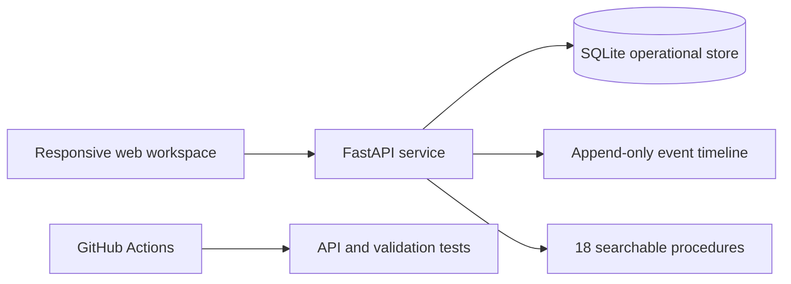

# Architecture

CloudAtlas uses a deliberately small three-layer design:

## Design decisions

- **FastAPI** provides typed request validation and generated OpenAPI documentation.
- **SQLite** keeps the single-node review build zero-configuration while retaining transactional behavior.
- **Plain HTML/CSS/JavaScript** avoids a large client dependency tree and keeps the interface fast.
- **Evidence events** are stored separately from the mutable case record so the operational story remains reviewable.
- **SLA summary is derived, not hand-entered.** The metrics endpoint calculates a
  deadline from `opened_at + sla_minutes` for each active case, then reports
  on-time, at-risk, and breached counts. Resolved cases are excluded rather than
  being treated as retroactive compliance evidence.
- **Container support** makes the same app runnable locally or in a small cloud environment.

## Scaling path

For production, replace SQLite with PostgreSQL, add OIDC authentication, use a queue for notifications, and export traces and metrics through OpenTelemetry.
